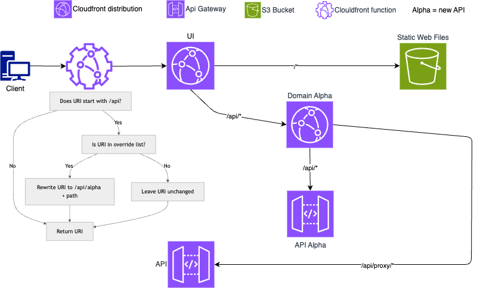

# aws-subpath-api-hosting

Access an api via the same cloudfront distribution.

*Problem 1*: Accessing [internal] APIs via domains can result in CORs issues and require mitigation.

*Solution 1*: Access API via a path from the site making the request.

Thank you to Lewis for his guidance and [repo](https://github.com/Lewiscowles1986/aws-cors-cloudfront)

*Problem 2*: When `/api` returns an error by default cloudfront will return its `custom_error_response`. A `custom_error_response` is required by react to catch refreshes direct navigation for non-public s3 buckets.

*Solution 2*: Cloudfront function to add the `/index.html`.

*Problem 1*: To A/B test the api served at `/api` with a static url and not having to update origins (which takes ages..).

*Solution 2*: Cloudfront function to change the path of the request + cloudfront in front of target api with ordered cache behavior to direct to desired api. Updating a cloudfront function takes seconds.

## access

- obtain url from output as per below

```sh
cloudfront_url = "https://d2t9lieeiaps7k.cloudfront.net"
```

## infra



## private S3 bucket issues

To keep an S3 bucket private means that it cannot be in web hosting mode. This example only allows account cloudfront distributions to access the s3 bucket.

**This creates an issue**. When directly navigating to a page and/or refreshing will result in a 404 as the `index.html` is not appended in the request. React SPAs handle routing on the client, so all routes must load index.html, which bootstraps the app and interprets the URL which will have a path of `/page_name?param=value`. S3 will fail as object `/page_name` will not exist.

Quick/shonky workaround is to add a `custom_error_response` to return `\index.html`

A better solution can be seen in `resource "aws_cloudfront_function" "handle_spa_routing"`. This will append `/index.html `to those requests missing it.

Urls which this function supports;
- https://d3asn8cy0ghl7c.cloudfront.net/page1?this=that
- https://d3asn8cy0ghl7c.cloudfront.net/page1
- https://d3asn8cy0ghl7c.cloudfront.net
